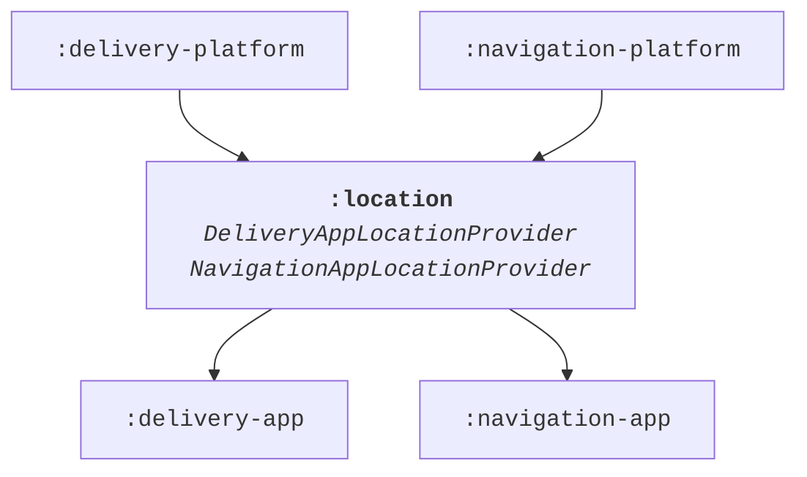
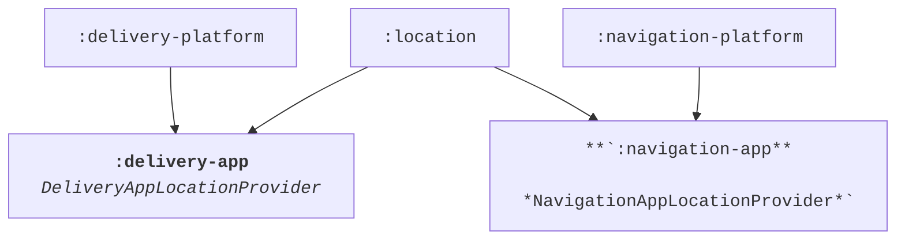

# Module Structure

!!! note

    Using the module structure is an opt-in feature through the Gradle DSL. The default value is `false` and
    this feature has to be enabled for each module.
    ```groovy
    appPlatform {
      enableModuleStructure true
    }
    ```

## Background

The App Platform separates APIs from implementations by splitting the code in separate Gradle modules. The same
recommendation applies not only to other core libraries but also feature code due to the many benefits such as
smaller dependency graphs, lower coupling and a simple mechanism to replace dependencies with fakes.

Imagine having two implementations of the shared interface `LocationProvider` for two applications
*Delivery App* and *Navigation App*:

```kotlin
interface LocationProvider {
  val location: StateFlow<Location>
}

class DeliveryAppLocationProvider(
  private val dataLayer: DeliveryAppDataLayer,
  ...
) : LocationProvider {..}

class NavigationAppLocationProvider(
  private val application: NavigationApplication,
  ...
) : LocationProvider {..}
```

If both classes live in the same module, then the shared Gradle module must depend on modules belonging to
*Delivery* and *Navigation* App at the same time. This is not ideal, because then the *Delivery App* would
automatically depend on code from the *Navigation App* and the *Navigation App* on *Delivery App* code through
a transitive dependency as highlighted in the diagram below.



To avoid the issue of the transitive dependencies, concrete implementation classes `DeliveryAppLocationProvider`
and `NavigationAppLocationProvider` could be moved into the final respective application packages `:delivery-app`
and `:navigation-app`.



However, this would be a bad approach from a modularization standpoint. The app modules would become
larger and larger over time and the many classes within it would have a low cohesion level. Build times get
longer roughly linear to the size of the module, because individual build steps such as Kotlin compilation
can’t be parallelized.

Instead, a similar approach to dependency inversion in Kotlin code is applied to modules. The shared package can be split into a public API and implementation sub-module:
