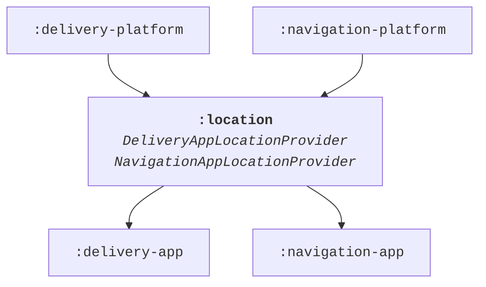
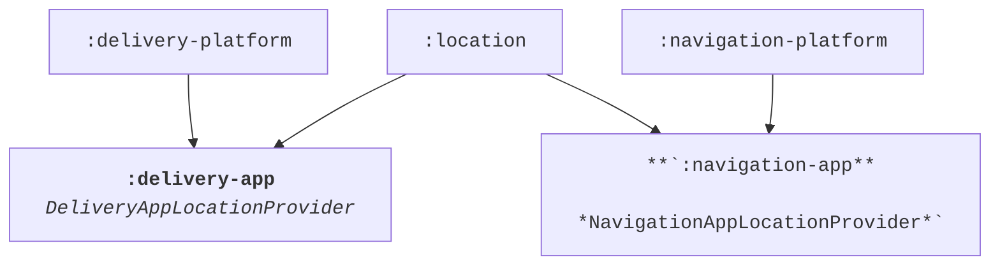
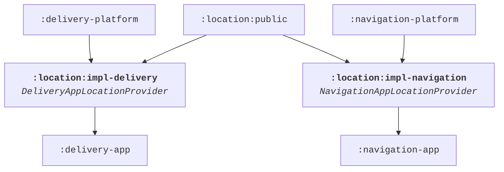

# Module Structure

!!! note

    Using the module structure is an opt-in feature through the Gradle DSL. The default value is `false` and
    this feature has to be enabled for each module.
    ```groovy
    appPlatform {
      enableModuleStructure true
    }
    ```

## Dependency inversion in Kotlin code

Dependency inversion means that high-level APIs don’t depend on low-level details and low-level details
only import other high-level APIs. It significantly reduces coupling between components. Dependency
inversion can be implemented on different levels, e.g. in code and in the module structure.

Dependency inversion implemented in Kotlin code refers to having abstractions in place instead of
relying on concrete implementations. Imagine this example:

```kotlin
class AccountProvider(
  private val database: SqliteDatabase,
  ...
) {
  val currentAccount: StateFlow<Account> = ...

  fun updateCurrentAccount(account: Account) {
    ...
  }
}

class ChangeAccountHandler(
  private val accountProvider: AccountProvider
) {

  private fun onAccountChanged(account: Account) {
    accountProvider.updateCurrentAccount(account)
    ...
  }
}
```

`ChangeAccountHandler` has a strong dependency on `AccountProvider`. This is problematic in multiple ways.
Evolving `AccountProvider` is challenging, because implementation details are easily leaked and become
part of the public API. Every dependency from `AccountProvider` is exposed to consumers, e.g. `ChangeAccountHandler`
knows that `AccountProvider` uses Sqlite for its implementation, a detail which should be hidden and makes
dependency graphs unnecessarily large. `ChangeAccountHandler` is hard to test. One has to spin up a Sqlite database
in a unit test environment in order to instantiate `AccountProvider` and pass it as argument to
`ChangeAccountHandler`.

A much better approach is introducing abstract APIs:

```kotlin
interface AccountProvider {
  val currentAccount: StateFlow<Account>

  fun updateCurrentAccount(account: Account)
}

class SqliteAccountProvider(
  private val database: SqliteDatabase
  ...
) : AccountProvider {

  @VisibleForTesting
  val allAccounts: List<Account> = ...

  ...
}
```

The interface `AccountProvider` solves the mentioned shortcomings. `SqliteAccountProvider` can change and
for example expose more fields (`allAccounts` in this sample) for verifications in unit tests without anyone
knowing as the interface doesn’t need to be updated. Sqlite is a pure implementation detail and no consumer
of `AccountProvider` has to know about it. This allows us to easily swap the implementation for a fake
`AccountProvider` together with fake data in a unit test for `ChangeAccountHandler`.

Breaking the dependency serves an additional purpose especially in Kotlin Multiplatform when
implementations have platform dependencies:

```kotlin
// commonMain
interface SqlDriver

// androidMain
class AndroidSqlDriver(context: Context) : SqlDriver

// iosMain
class NativeSqlDriver() : SqlDriver
```

Notice how the Android implementation has a strong dependency on the Android runtime through the `Context`
class. Relying on interfaces / abstract classes together with dependency injection is the
[preferred way](https://www.jetbrains.com/help/kotlin-multiplatform-dev/multiplatform-connect-to-apis.html#dependency-injection-framework) (1)
over `expect / actual` functions to implement dependency inversion as this approach allows platform specific changes.
{ .annotate }

1.  When you use a DI framework, you inject all of the dependencies through this framework. The same logic applies to handling platform dependencies. We recommend continuing to use DI if you already have it in your project, rather than using the expected and actual functions manually. This way, you can avoid mixing two different ways of injecting dependencies.

## Module structure background

The App Platform separates APIs from implementations by splitting the code in separate Gradle modules. The same
recommendation applies not only to other core libraries but also feature code due to the many benefits such as
smaller dependency graphs, lower coupling and a simple mechanism to replace dependencies with fakes.

Imagine having two implementations of the shared interface `LocationProvider` for two applications
*Delivery App* and *Navigation App*:

```kotlin
interface LocationProvider {
  val location: StateFlow<Location>
}

class DeliveryAppLocationProvider(
  private val dataLayer: DeliveryAppDataLayer,
  ...
) : LocationProvider {..}

class NavigationAppLocationProvider(
  private val application: NavigationApplication,
  ...
) : LocationProvider {..}
```

If both classes live in the same module, then the shared Gradle module must depend on modules belonging to
*Delivery* and *Navigation* App at the same time. This is not ideal, because then the *Delivery App* would
automatically depend on code from the *Navigation App* and the *Navigation App* on *Delivery App* code through
a transitive dependency as highlighted in the diagram below.



To avoid the issue of the transitive dependencies, concrete implementation classes `DeliveryAppLocationProvider`
and `NavigationAppLocationProvider` could be moved into the final respective application packages `:delivery-app`
and `:navigation-app`.



However, this would be a bad approach from a modularization standpoint. The app modules would become
larger and larger over time and the many classes within it would have a low cohesion level. Build times get
longer roughly linear to the size of the module, because individual build steps such as Kotlin compilation
can’t be parallelized.

Instead, a similar approach to [dependency inversion in Kotlin code](module-structure.md#dependency-inversion-in-kotlin-code)
is applied to modules. The shared package can be split into a public API and implementation sub-module:



By cleanly separating shared code in `:public` modules from implementations in `:impl` modules we break
dependencies in our build graph. `DeliveryAppLocationProvider` and `NavigationAppLocationProvider` provide a
separate implementation for each application target of the shared API, have dependencies on each individual
platform and yet don’t leak any implementation details nor platform APIs.

In order to follow the dependency inversion principle correctly the most important rule in this module structure
is that no other module but the final application module is allowed to depend on `:impl` modules. `:public`
modules on the other hand are widely shared and can be imported by any other module.
