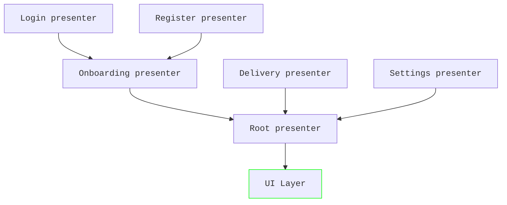

# Presenters

!!! note

    While App Platform has a generic `Presenter` interface to remove coupling, we strongly recommend using
    `MoleculePresenter` for implementations. `MoleculePresenters` are an opt-in feature through the Gradle DSL.
    The default value is `false`.

    ```groovy
    appPlatform {
      enableMoleculePresenters true
    }
    ```

## Unidirectional dataflow

App Platform implements the unidirectional dataflow pattern to decouple business logic from UI rendering. Not only
does this allow for better testing of business logic and provides clear boundaries, but individual apps can also
share more code and change the look and feel when needed.

## `MoleculePresenter`

In the unidirectional dataflow pattern events and state only travel into one direction through a single stream.
State is produced by `Presenters` and can be observed through a reactive stream:

```kotlin
interface Presenter<ModelT : BaseModel> {
  val model: StateFlow<ModelT>
}
```

`Presenters` can be implemented in many ways as long as they can be converted to this interface. App Platform
provides and recommends the implementation using [Molecule](https://github.com/cashapp/molecule) since it provides
many advantages. Molecule is a library that turns a `@Composable` function into a `StateFlow`. It leverages the
core of [Compose](https://developer.android.com/compose) without bringing in Compose UI as dependency. The primary
use case of Compose is handling, creating and modifying tree-like data structures, which is a natural fit for
UI frameworks. Molecule reuses Compose to handle state management and state transitions to implement business
logic in the form of `@Composable` functions with all the benefits that Compose provides.

The [MoleculePresenter](https://github.com/amzn/app-platform/blob/main/presenter-molecule/public/src/commonMain/kotlin/software/amazon/app/platform/presenter/molecule/MoleculePresenter.kt)
interface looks like this:

```kotlin
interface MoleculePresenter<InputT : Any, ModelT : BaseModel> {
  @Composable
  fun present(input: InputT): ModelT
}
```

[`Models`](https://github.com/amzn/app-platform/blob/main/presenter/public/src/commonMain/kotlin/software/amazon/app/platform/presenter/BaseModel.kt)
represent the state of a `Presenter`. Usually, they’re implemented as immutable, inner data classes of the `Presenter`.
Using sealed hierarchies is a good practice to allow to differentiate between different states:

```kotlin
interface LoginPresenter : MoleculePresenter<Model> {
  sealed interface Model : BaseModel {
    data object LoggedOut : Model

    data class LoggedIn(
      val user: User,
    ) : Model
  }
}
```

Notice that it’s recommended even for `Presenters` to follow the dependency inversion principle. `LoginPresenter` is
an interface and there can be multiple implementations.

??? example "Sample"

    The sample application follows the same principle of dependency inversion. E.g. the API of the
    [`LoginPresenter`](https://github.com/amzn/app-platform/blob/main/sample/login/public/src/commonMain/kotlin/software/amazon/app/platform/sample/login/LoginPresenter.kt)
    is part of the `:public` module, while the implementation [`LoginPresenterImpl`](https://github.com/amzn/app-platform/blob/main/sample/login/impl/src/commonMain/kotlin/software/amazon/app/platform/sample/login/LoginPresenterImpl.kt)
    lives in the `:impl` module. This abstraction is used in tests, where [`FakeLoginPresenter`](https://github.com/amzn/app-platform/blob/main/sample/navigation/impl/src/commonTest/kotlin/software/amazon/app/platform/sample/navigation/NavigationPresenterImplTest.kt#L45-L49)
    simplifies the test setup of classes relying on `LoginPresenter`.

Observers of the state of a `Presenter`, such as the UI layer, communicate back to the `Presenter` through events.
Events are sent through a lambda in the `Model`, which the `Presenter` must provide:

```kotlin hl_lines="16"
interface LoginPresenter : MoleculePresenter<Unit, Model> {

  sealed interface Event {
    data object Logout : Event

    data class ChangeName(
      val newName: String,
    ) : Event
  }

  sealed interface Model : BaseModel {
    data object LoggedOut : Model

    data class LoggedIn(
      val user: User,
      val onEvent: (Event) -> Unit,
    ) : Model
  }
}
```

A concrete implementation of `LoginPresenter` could look like this:

```kotlin
@Inject
@ContributesBinding(AppScope::class)
class AmazonLoginPresenter : LoginPresenter {
  @Composable
  fun present(input: Unit): Model {
    ..
    return if (user != null) {
      LoggedIn(
        user = user,
        onEvent = onEvent { event ->
          when(event) {
            is Logout -> ..
            is ChangeName -> ..
          }
        }
      )
    } else {
      LoggedOut
    }
  }
}
```

!!! note

    `MoleculePresenters` are never singletons. While they use `kotlin-inject-anvil` for constructor injection and
    automatically bind the concrete implementation to an API using `@ContributesBinding`, they don't use the
    `@SingleIn` annotation. `MoleculePresenters` manage their state in the `@Composable` function with the Compose
    runtime. Therefore, it's strongly discouraged to have any class properties.

!!! warning

    Notice that the lambda for `onEvent` is wrapped in the [`onEvent` function](https://github.com/amzn/app-platform/blob/main/presenter-molecule/public/src/commonMain/kotlin/software/amazon/app/platform/presenter/molecule/OnEvent.kt).

    ```kotlin hl_lines="1"
    onEvent = onEvent { event ->
      when(event) {
        is Logout -> ..
        is ChangeName -> ..
      }
    }
    ```

    This is important for `data classes` in order to preserve equality. Internally, the `onEvent` function creates
    and reuses a separate lambda to ensure that `BaseModel` instances holding the same data are still considered
    equal although the `onEvent` lambda has changed between compositions.

## Model driven navigation

`Presenters` are composable, meaning that one presenter could combine N other presenters into a single stream of
model objects. With that concept in mind we can decompose large presenters into multiple smaller ones. Not only
do they become easier to change, maintain and test, but we can also share and reuse presenters between multiple
screens if needed. Presenters form a tree with nested presenters. They’re unaware of their parent and communicate
upwards only through their `Model`.

```kotlin hl_lines="14 17"
class OnboardingPresenterImpl(
  // Make presenters lazy to only instantiate them when they're actually needed.
  private val lazyLoginPresenter: () -> LoginPresenter,
  private val lazyRegistrationPresenter: () -> RegistrationPresenter,
) : OnboardingPresenter {

  @Composable
  fun present(input: Unit): BaseModel {
    ...
    return if (mustRegister) {
      // Remember the presenter to avoid creating a new one during each
      // composition (in other words when computing a new model).
      val registrationPresenter = remember { lazyRegistrationPresenter() }
      registrationPresenter.present(Unit)
    } else {
      val loginPresenter = remember { lazyLoginPresenter() }
      loginPresenter.present(Unit)
    }
  }
}
```

Notice how the parent presenter calls the `@Composable` `present()` function from the child presenters like
a regular function to compute their model and return it.

??? example "Sample"

    [`NavigationPresenterImpl`](https://github.com/amzn/app-platform/blob/main/sample/navigation/impl/src/commonMain/kotlin/software/amazon/app/platform/sample/navigation/NavigationPresenterImpl.kt)
    is another example that highlights this principle.

    [`UserPagePresenterImpl`](https://github.com/amzn/app-platform/blob/main/sample/user/impl/src/commonMain/kotlin/software/amazon/app/platform/sample/user/UserPagePresenterImpl.kt)
    goes a step further. Its `BaseModel` is composed of two sub-models. The `listModel` is even an input for the
    detail-presenter.

    ```kotlin
    val listModel = userPageListPresenter.present(UserPageListPresenter.Input(user))
    return Model(
      listModel = listModel,
      detailModel =
        userPageDetailPresenter.present(
          UserPageDetailPresenter.Input(user, selectedAttribute = listModel.selectedIndex)
        ),
    )
    ```

This concept allows us to implement model-driven navigation. By driving the entire UI layer through `Presenters` and
emitted `Models` navigation becomes a first class API and testable. Imagine having a root presenter implementing a
back stack that forwards the model of the top most presenter. When the user navigates to a new screen, then the
root presenter would add a new presenter to the stack and provide its model object.



In the example above, the root presenter would forward the model of the onboarding, delivery or settings presenter
to the UI layer. The onboarding presenter as shown in the code example can either call the login or registration
presenter based on a condition. With Molecule calling a child presenter is as easy as invoking a function.

## Parent child communication

While the pattern isn’t used frequently, parent presenters can provide input to their child presenters. The
returned model from the child presenter can be used further to change the control flow.

```kotlin
interface ChildPresenter : MoleculePresenter<Input, Model> {
  data class Input(
    val argument: String,
  )
}

class ParentPresenterImpl(
  private val lazyChildPresenter: () -> ChildPresenter
) : ParentPresenter {

  @Composable
  fun present(input: Unit) {
    val childPresenter = remember { lazyChildPresenter() }
    val childModel = childPresenter.present(Input(argument = "abc"))

    return if (childModel...) ...
  }
}
```

This mechanism is favored less, because it only allows for direct parent to child presenter interactions and
becomes hard to manage for deeply nested hierarchies. More often a service object is injected instead, which
is used by the multiple presenters:

```kotlin hl_lines="8 12 20 25 28"
interface AccountManager {
  val currentAccount: StateFlow<Account>

  fun mustRegister(): Boolean
}

class AmazonLoginPresenter(
  private val accountManager: AccountManager
): LoginPresenter {
  @Composable
  fun present(input: Unit): Model {
    val account by accountManager.currentAccount.collectAsState()
    ...
  }
}

class OnboardingPresenterImpl(
  private val lazyLoginPresenter: () -> LoginPresenter,
  private val lazyRegistrationPresenter: () -> RegistrationPresenter,
  private val accountManager: AccountManager,
) : OnboardingPresenter {

  @Composable
  fun present(input: Unit): BaseModel {
    val account by accountManager.currentAccount.collectAsState()
    ...

    return if (accountManager.mustRegister()) {
      val registrationPresenter = remember { lazyRegistrationPresenter() }
      registrationPresenter.present(Unit)
    } else {
      val loginPresenter = remember { lazyLoginPresenter() }
      loginPresenter.present(Unit)
    }
  }
}
```

This example shows how `AccountManager` holds state and is injected into multiple presenters instead of relying
on presenter inputs.
