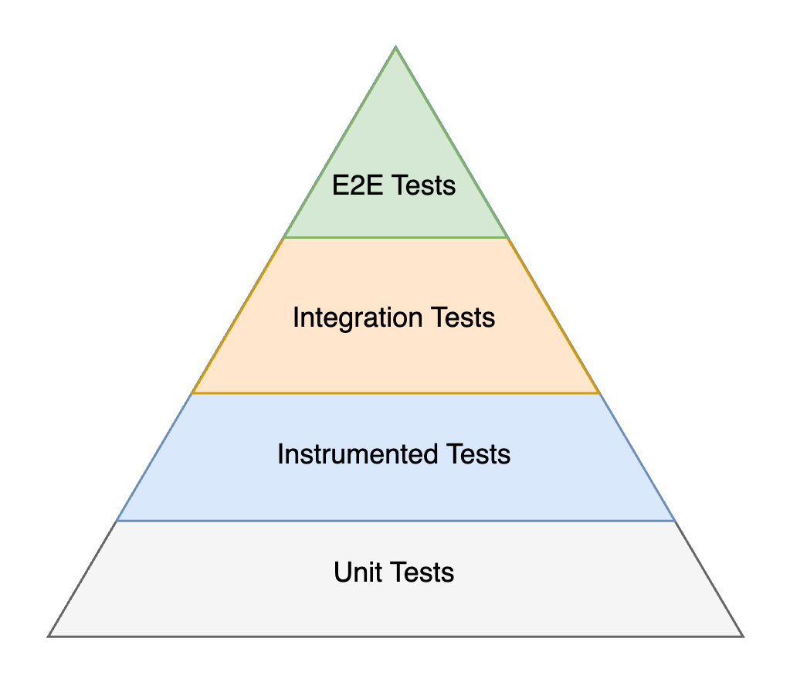

# Testing

A fundamental design pattern to make testing effective is dependency inversion, which means that high-level
APIs don’t depend on low-level details and low-level details only import other high-level APIs.
It significantly reduces coupling between components.

App Platform implements the pattern in its [module structure](module-structure.md#gradle-modules) and in
[Kotlin code](module-structure.md#kotlin-code). By relying on dependency inversion, we decouple projects from
their dependencies and enable testing in isolation. This approach is important for unit tests, instrumented tested
and integration tests. These three types of tests rely on a chain of trust, where we assume that dependencies
are functioning and tests don’t need to be repeated.

{ width="400" }

## Fakes

Unit tests build the foundation of the testing pyramid. They verify the smallest components of our app, which
usually are single classes or functions and we rarely test multiple classes in combination. Dependencies of
these classes are typically replaced by fakes. Due to this low coupling unit tests tend to be very stable.

!!! info "Fakes vs real implementations"

    Using real implementations of dependencies for the unit under test is a valid option as it brings the
    tested code close to production, increases confidence and removes isolation.
    A [best practice from Google](https://abseil.io/resources/swe-book/html/ch13.html) is summarized as:

    > A real implementation is preferred if it is fast, deterministic, and has simple dependencies. For example,
    > a real implementation should be used for a value object. Examples include an amount of money, a date, a
    > geographical address, or a collection class such as a list or a map.
    >
    > However, for more complex code, using a real implementation often isn’t feasible. There might not be an
    > exact answer on when to use a real implementation or a test double given that there are trade-offs to be made.

    The trade-offs include execution time, determinism and dependency construction. Fakes improve all three points
    by avoiding slow IO, returning stable results and breaking dependency chains at the cost of diverging from the
    behavior in production and reduced confidence.

```kotlin
interface LocationProvider {
  val location: StateFlow<Location>
}

class RoutingRepository(
  private val locationProvider: LocationProvider
)
```

Imagine to test `RoutingRepository`. To create an new instance under test, we must provide a `LocationProvider`.
Since we use dependency inversion and didn’t hardcode a concrete implementation, it is simple to implement a fake
for this interface:

```kotlin
class FakeLocationProvider(
  val currentLocation: Location = Location(..)
) : LocationProvider {
  private val _location = MutableStateFlow(currentLocation)
  override val location = _location

  fun updateLocation(newLocation: Location) {
    _location.value = newLocation
  }
}
```

Now we can instantiate our `RoutingRepository`:

```kotlin
@Test
fun `the route is updated when the driver doesn't follow directions`() {
  val locationProvider = FakeLocationProvider()
  val routingRepository = RoutingRepository(locationProvider)

  locationProvider.updateLocation(...)
}
```

Good fake implementations are valuable. It’s best practice and strongly encouraged as an API provider to implement
fakes for APIs and share them with consumers. The [App Platform module structure](module-structure.md) provides
[`:testing` modules](module-structure.md#testing) for this purpose. For example, the owner of `LocationProvider`
is encouraged to use this structure:

```
:location-provider:public  src/commonMain/kotlin/.../LocationProvider.kt
:location-provider:testing src/commonMain/kotlin/.../FakeLocationProvider.kt
```

The owner of `RoutingRepository` can import `:location-provider:testing` and reuse the provided fake in tests.
This avoids duplication.
